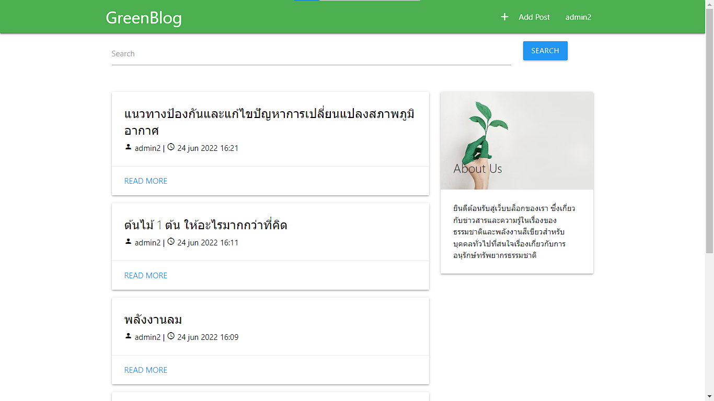
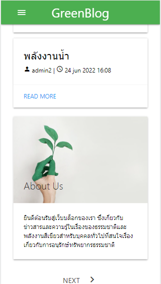

# Greenblog | เว็บบล็อกสีเขียว

## About Us
เป็นเว็บแอพพลิเคชันโดยใช้ภาษา Python ผ่าน Django Framework เพื่อให้ข่าวสารและความรู้ในเรื่องของธรรมชาติและพลังงานสีเขียวสำหรับบุคคลทั่วไปที่สนใจเรื่องเกี่ยวกับการอนุรักษ์ทรัพยากรธรรมชาติ

โดย Project เป็นส่วนหนึ่งเพื่อใช้ในการนำเสนอผลงานเพื่อใช้สำหรับส่งโครงงานเพื่อรับใบประกาศนียบัตรในคอร์ส Django from Zero จากทาง BorntoDev

## Role
1. Blogger (Admin)
2. User
3. Guest

## Database
Database : sqlite3

## Preview
<p align="center">
  
</p>
<p align="center">
  Desktop
</p>
<p align="center">
  
</p>
<p align="center">
  Mobile (Responsive)
</p>
## How to Run?

1. สร้างและรัน virutalenv

```
python -m venv env
env\Script\activate
```

2. ติดตั้ง requirements.txt
```
pip install -r requirements.txt
```

3. migrate ข้อมูลลง database
```
python manage.py makemigrations (ถ้ามีการเปลี่ยนแปลง)
python manage.py migrate
```

4. รัน django :)
```
python manage.py runserver
```
